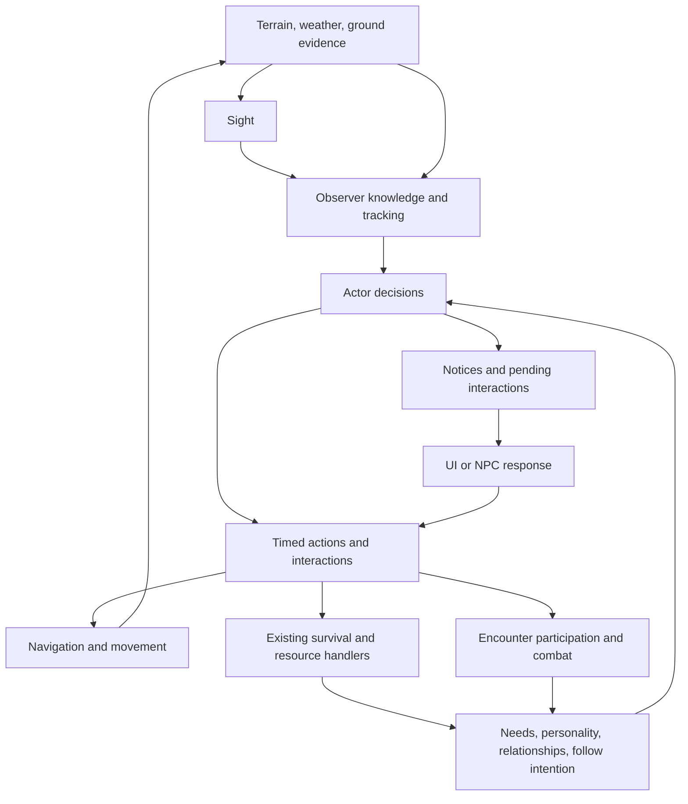

# Autonomous companions — architecture and implementation plan

Status: proposed implementation plan, 2026-09-06. This document consolidates the design discussion and a source inspection of the current repository. It is a plan, not a claim that the proposed behavior is implemented or tested.

Test-first work has begun in [`text_survival.Tests/Companions`](../text_survival.Tests/Companions/README.md). Its README records which scenarios are executable, which require future interfaces, and how to run the deliberately red acceptance suite separately from existing regressions.

## 1. Experience and scope

An NPC is an independent survivor who can choose to accompany another actor. Companionship should normally require little attention: companions follow, take care of themselves, and act autonomously in combat. Their own needs, personality, and relationship determine when accompanying someone becomes untenable.

Agreed direction:

- Keep the existing single relationship opinion derived from memories. Give Boldness, Sociability, and Selfishness clear behavioral roles; do not add affection/trust/respect meters.
- Support explicit invitations and voluntary following. Both establish the same following intention.
- Following may target the player or another NPC. Shared mechanics accept actors and allow a future non-human follower, such as a dog, without requiring human motivations.
- Typically expect 1–4 companions, with larger temporary gatherings possible. No hard party cap or permanent party roster is needed. Resource consumption should remain real.
- NPCs finish ordinary work already in progress when their target leaves, then attempt to catch up. Immediate dangers can still interrupt work.
- They observe visible departures while working. Once sight is lost, they use remembered observations and physically available tracks, and can eventually lose the trail.
- NPCs remain responsible for food, water, warmth, and rest. When a need conflicts with accompanying someone, they can request help or announce a departure.
- Player responses include letting them go, providing a relevant resource, or asking them to stay. Requests have cooldowns; reassurance has limited duration or tolerance.
- The player can inspect inventory and ask for items. Requests consider relationship, selfishness, and how much the owner needs the item.
- Combat stays autonomous. Calls for help or retreat influence existing decisions instead of assigning individual turns or targets.
- Relationship causes, current intention, and important concerns should be visible without exposing every AI calculation in the normal UI.

Future expansion, outside this implementation: faction splits, camp politics, a complete dog/scent simulation, scripted companion quest lines, formations, direct party controls, and a universal AI framework for every species. Architectural support for those directions must come from reusable boundaries, not speculative implementations.

## 2. Existing foundations and constraints

These are source-level observations. The historical NPC simulation document includes superseded findings; use current code and fresh measurements as the implementation baseline.

| Existing area | What is useful | What this project needs to change |
| --- | --- | --- |
| `Actors/Actor.cs` | Common body, capabilities, location, inventory interface, and combat properties | Shared observation/following mechanics must operate on this common identity, with optional state for actors using them |
| `Actors/NPC/NPC.cs` | Extensive needs, resource acquisition, camp work, crafting, and threat decisions | Separate observation, decision selection, and action execution; add following as an enduring intention |
| `Actors/NPC/NPCActions.cs` | Timed work and movement using shared survival/action handlers | Replace default interrupt-means-complete semantics with explicit progress and cancellation contracts |
| `RelationshipMemory` / `RelationshipEvents` | One directional score and memory causes | Wire meaningful interactions; bound passive accumulation; keep scoring in one place |
| `GameMap.UpdateVisibility` | Tested terrain absorption, occlusion, vantage, weather, and sight-capacity rules | Extract observer-independent calculation from player exploration mutation |
| `GameMap.GetNextInPath` | Existing movement callers have a clear entry point | Replace player/map coupling and greedy-only search with shared navigation plus a replaceable pathfinder |
| `GameMap.RecordMove` | Shared footprint and trail-wear recording seam | Preserve it as one authoritative completed-crossing operation while generalizing actor movement |
| `TrackRegistry` | Ground evidence and weather-driven erosion | Aggregates lose individual passage ordering; add enough bounded detail for local trail reasoning |
| `TravelProcessor` | Actor-aware traversal time and injury calculations | Keep traversal rules shared by player, NPCs, and herds; separate planning estimates from execution |
| `GameContext.UpdateInternal` | Central world clock | Make observation ordering and per-actor action ownership explicit |
| `CombatOrchestrator` / `CombatScenario` | Teams, autonomous turns, morale, shared aftermath | Differentiate hunting from defense, handle joining late, and finish remaining combat after player departure |
| `NPCOverlay` | Read-only needs, action log, inventory categories, water, and gear | Add intention/relationship presentation and invitation/give/request actions |
| `EventQueue` / `IGameUi` | Existing event and interaction presentation | Deliver deterministic social requests safely; request delivery cannot depend on random-event probability |
| `SaveManager` | Reference-preserving serialization and round-trip tests | Persist new intentions, knowledge, cooldowns, and committed work; reconstruct runtime services |
| `tools/NpcSim` | Reproducible serial experiments over real simulation ticks | Extend with following and interaction scenarios and metrics |

Specific traps to cover during implementation:

- `Selfishness` is currently unused. `Sociability` affects combat cohesion. `Boldness` affects exploration and willingness/fight-or-flight, but is separate from `Actor.StartingBoldness` used inside combat. Document that distinction before changing balance.
- `SharedFood`, `SavedMe`, and `AbandonedMe` have helper methods but no gameplay callers. Positive shared-time and qualifying shared-combat memories are wired.
- Opinion is clamped only after an unbounded sum. Shared time alone reaches +1 from neutral in 1,000 minutes, and excess accumulation buffers later harm.
- Cache-taking decisions currently retrieve fuel and tools, while food/water need paths do not retrieve those supplies from the cache.
- Non-fuel stockpile targets assume one person. NPC sleep requires their assigned camp. Both interfere with autonomous expeditions.
- `WouldDefend` requires a hostile threat, excluding ordinary prey from cooperative hunts.
- Player combat advances normal NPC updates without an active-combat exclusion.
- `NPCAction.Interrupt` defaults to `Complete`; this is unsafe for frequent ownership transfers. Food is currently removed while selecting some eating actions, making cancellation and save behavior important.
- `NPC.Update(minutes)` contains an early return while executing an action; do not assume batching several minutes is equivalent to repeated one-minute calls.
- Visibility lives on `Location` as player-facing fog state. An NPC query must never mutate it.
- `GameMap.MoveTo` updates the player map cursor and exploration. Generic actor movement must not call it indiscriminately.
- Herds and animal members have separate location-bearing objects. Shared perception must use the authoritative world position and avoid duplicate movement/survival processing.

## 3. Ownership model and invariants

The key distinction is enduring intention versus immediate action versus current action owner.



The game clock schedules these operations. It does not absorb their detailed decision rules.

| Owner | Authoritative responsibility |
| --- | --- |
| Actor state | Body, possessions, identity, relevant knowledge, persistent intentions |
| Relationship memory | Memory storage and opinion calculation |
| NPC decision policy | Willingness, priority conflicts, next-action selection, giving up a search |
| Sight | Present visibility from an observer; no exploration or relationship changes |
| Tracking | Evidence available to an observer and the next supported lead |
| Navigation | Traversability and route planning against a destination already known to the caller |
| Movement execution | Actual crossing, elapsed effort, location change, tracks, and trail wear |
| Interaction resolution | Consent, transfer validity, agreements, cooldown changes, and social consequences |
| Activity/encounter coordination | Which system executes each actor's current activity, and handoff boundaries |
| UI and event presentation | Descriptions and choices; no independent AI rules or inventory mutations |

Required invariants:

1. Each elapsed world minute updates each applicable body once; its activity context comes from its actual activity owner.
2. An actor has one action executor at a time. Observation may run alongside execution; another action may not.
3. Querying sight, tracking, or routes never moves an actor, grants resources, changes explored tiles, or advances the clock.
4. A hidden target's movement cannot update observer knowledge without new perceptible evidence.
5. Following intention survives ordinary work, temporary survival detours, and combat. Ending pursuit, ending an agreement, and losing a target are distinct outcomes.
6. Resource transfer and work completion apply once. Interrupted work cannot receive unearned full completion.
7. An actor remains the same entity across world updates, following references, combat rosters, and saves.
8. No shared mechanic assumes that a leader, recipient, rescuer, or ally is the player.
9. Followers can form chains, but self-following and circular following agreements are rejected.
10. Evidence age, cooldowns, search effort, and agreement durations use game time, not UI frames or query counts.
11. Repeated presentation or reevaluation cannot reroll the same request or reset search persistence without a new cause.
12. Existing solo play and non-following NPC survival remain supported throughout migration.

## 4. Spatial subsystem contracts

### 4.1 Sight

Extract the ray traversal and sight-budget calculation into a focused `Sight` module under `Environments/Perception`.

Conceptual public operations:

```csharp
Sight.VisibleTiles(map, origin, sightCapacity);
Sight.CanSeeTile(map, origin, destination, sightCapacity);
Sight.CanSeeActor(observer, target, worldView);
```

Exact names may change during implementation. The contract is explicit observer inputs and no global cursor or fog mutations.

- Preserve current map rendering behavior first, including visibility of blocking destination terrain and opaque-corner rules.
- Have player exploration consume visible-tile results through a clearly player-scoped update. Keep the existing save representation initially.
- Actor detection has its own entry point: seeing the face of a blocking tile, or always showing the observer's own tile in fog rendering, does not automatically prove an actor is visually detectable. Gate visual observations on usable sight/consciousness and define same-tile behavior explicitly.
- Compute against a consistent observer snapshot. Do not allocate a full explored map per NPC.
- Observe relevant targets and nearby actors; avoid all-pairs full-map visibility scans. Profile before adding caches. Any later cache must include position, capabilities, weather, and terrain changes.
- World-map perception and combat awareness use different spatial scales. Preserve the combat detection model; do not force the world sight algorithm into its tactical grid.

Acceptance: old visibility tests pass; two observers have independent answers; NPC queries leave player fog unchanged; terrain/weather/capacity changes alter observations while stationary.

### 4.2 Navigation and replaceable pathfinding

Introduce an explicit algorithm seam:

```csharp
public interface IPathfinder
{
    PathResult FindPath(PathRequest request, NavigationView navigation);
}
```

`NavigationView` is a concrete read-only view of allowed neighboring crossings and their costs. It encapsulates terrain passability, seasonal edge rules, the mover's traversal capabilities, and the selected knowledge policy. The pathfinder only searches this view.

`Navigation` presents the deeper game-facing operation: find a route for this mover to this known destination. It builds the view, calls `IPathfinder`, and handles route validity. This is a meaningful separation: movement rules can change independently of the search algorithm.

Contract details:

- `PathRequest`: explicit origin, destination, and maximum expanded-node budget. The game-facing request also specifies the mover and relevant travel policy.
- `PathResult`: `Found`, `AlreadyThere`, `NoRoute`, or `BudgetExceeded`; an ordered route, estimated cost in game minutes, and diagnostics useful to the harness.
- Route steps exclude the origin and include the destination. Every pair of consecutive positions is a legal crossing.
- `NoRoute` means exhaustive failure within the supplied navigation view. Hitting a budget, lacking knowledge, or greedy search getting stuck must not masquerade as proof of physical impossibility.
- Planning never changes locations or leaves tracks. Revalidate each crossing at execution; weather, barriers, and injuries can invalidate an earlier plan or cost estimate.
- Use shared traversal calculations for costs. Do not duplicate speed/load/trail formulas inside algorithms. Survival risk tolerance belongs to a supplied policy rather than a hidden A* weight.
- Match current cardinal world movement. Diagonal/corner rules must be explicit if introduced later.
- Known destinations are observations or resource memories. A navigation query must never retrieve a hidden target's current position. Initially allow routing through map topology as a documented simplification, while keeping the view capable of restricting unknown terrain later; no new NPC exploration grid is required now.
- Deterministic neighbor and equal-cost ordering are part of the contract. Replanning the same request must not create random wandering.

Migration and initial algorithm:

1. Characterize existing callers and extract the search seam. The old greedy routine may exist temporarily as an internal migration adapter, with its inability to prove `NoRoute` explicit.
2. Use a small deterministic Dijkstra implementation as the correctness baseline for weighted travel and detours. Do not ship new following on the assumption that greedy search can route around obstacles.
3. A future `AStarPathfinder` replaces the algorithm through `IPathfinder`; consumers and movement rules remain unchanged. Compare reachability and optimal cost against the Dijkstra baseline. A heuristic must be a valid lower bound under traversal modifiers; a zero heuristic remains a correct fallback.
4. Move `NPC.DecideToMove`, remembered-resource travel, and NPC fleeing through navigation. Migrate applicable herd route planning without interpreting intentional multi-tile herd hops as walked intermediate tiles.
5. Remove `GameMap.GetNextInPath` after callers migrate. `GameMap` retains topology and indexes. Single-step player input only needs crossing validation, not a pointless full route search.

This explicitly supports replacing the algorithm later while improving correctness during the foundation work.

### 4.3 Movement execution

Create one shared completed-crossing operation for actors and existing group movement adapters. Preserve `RecordMove` as the ground-update seam rather than adding competing footprint writers.

- Receives the actual mover, origin, destination, and movement profile. Profiles provide footprint kind, head count, and depth without a player/NPC switch in following.
- Updates the authoritative world location, records the actual crossing once, and exposes the event for observation/resource memory updates.
- Keep player map cursor, discovery, camera interpolation, and first-visit events in the player travel adapter.
- Keep visual interpolation separate from tile-scale simulation positions. Early versions may perceive actors at their last committed tile; departure direction is only available when observable. Do not let rendering coordinates silently become AI truth.
- Reconcile herd/member locations through a shared spatial view or synchronization contract before exposing animals to generic actor queries. Existing herd controllers retain their behavior ownership.
- Define cancellation at a crossing boundary. Preserve completed portions, never award a full route on interruption, and avoid duplicate tracks if control transfers to combat.

## 5. Evidence, knowledge, and tracking

### 5.1 Observer-owned knowledge

Keep physical world truth separate from what an actor knows. Begin with bounded records for current follow targets and recently relevant actors, rather than a general memory of everyone in the world.

A target record can retain:

- Target identity/reference.
- Last observed position and observation time.
- Last observed movement direction, if actually witnessed.
- A current trail lead and the evidence that supports it.
- Recently investigated evidence/locations sufficient to avoid loops.

Do not store the hidden actor's current destination or continuously synchronize the record from its location. Target identity is not permission to know its whereabouts. An unseen death or departure does not automatically notify the follower.

Separate ongoing observation from action selection. Conscious actors may refresh sightings while foraging, crafting, resting, or traveling. Sleeping actors do not observe visually. Processing observations for all relevant observers against one coherent tick snapshot prevents collection iteration order from deciding who witnessed a departure.

### 5.2 Tracking's deep interface

Two operations are justified by different timing:

```csharp
Tracking.Observe(observer, knowledge, worldView);  // world observation phase
Tracking.FindLead(observer, targetKnowledge, worldView); // decision boundary
```

`FindLead` returns a destination supported by current evidence, with an explanation kind such as `VisibleTarget`, `LastSighting`, `Trail`, or `NoLead`. It does not move the observer or decide whether continuing is worth the risk.

- Visual evidence takes precedence over an older trail.
- A remembered sighting supports travel to that remembered place. It does not imply the target remains there.
- Track inspection uses the observer's actual reachable inspection position. Visible terrain does not permit reading distant footprints.
- Candidate leads use compatible footprint kind, age, direction, local continuity, and previously observed departure. Ambiguity must be represented honestly.
- Repeatedly reading the same evidence is not new progress. Own recently made tracks and already-investigated branches cannot indefinitely renew the search.
- Search effort and elapsed time are maintained by following behavior, not changed by a pure query. A short local search can investigate bounded plausible leads before reporting no further evidence.
- Future scent or hearing evidence can enter here without changing human relationship logic or navigation. No scent simulation is required in this project.

### 5.3 Ground evidence improvements

The current per-tile aggregate cannot reconstruct turns or distinguish overlapping passages reliably. Keep its useful visual summaries and weather erosion model, but add bounded recent crossing evidence within `TrackRegistry`.

Proposed evidence: source/destination tile, footprint kind, sequence/time information, erosion stamp, head count, and depth. An arrival print and an onward departure must be distinguishable; one incoming heading alone is not proof of where someone went next.

- `TrackRegistry` owns both detail and its presentation summaries. AI must not create a separate private breadcrumb history that survives erased physical evidence.
- Bound retention by erosion and entry limits; prune deterministically. Detailed trail continuity can disappear before every trace of aggregate traffic disappears.
- Preserve weather history through the existing erosion accumulator rather than ticking every mark.
- Physical attribution, if stored for deduplication, is not automatically disclosed to observers. Human/paw/hoof shape remains the initial readable distinction.
- Use movement receipts or the observer's own recent movement history to avoid treating its new prints as evidence of target progress. This does not imply the observer can identify every other track owner.
- Old saves retain usable anonymous aggregate tracks. Do not invent precise passages or ownership from an aggregate. Display and trail-reading behavior should degrade honestly until fresh movements create detail.

## 6. Actor decisions and action lifecycle

### 6.1 Refactor by responsibility

Reduce `NPC.cs` to state and a clear update entry point. Extract cohesive decision code into a small number of modules:

- Need assessment and survival/resource action selection.
- Optional work/crafting selection, retaining existing handlers and the evolving crafting subsystem.
- Social willingness and interactions.
- Following behavior, consuming tracking and navigation.
- Timed action execution and interruption.

These are responsibility boundaries, not a requirement for an interface per module. Use concrete functions/classes until a real replaceable implementation is needed. Avoid a behavior-tree/GOAP conversion as part of this project.

### 6.2 Following state and priorities

Use an optional actor-owned follow intention containing target, search effort, meaningful agreement/cooldown state, and any necessary temporary suspension. Target knowledge remains observational state. Derive co-location, distance, and current separation instead of storing overlapping flags.

Human willingness reads the existing relationship, personality, health, and commitments. Shared following mechanics accept generic actors; they do not require `NPC.Personality` or a human `RelationshipMemory`. A future animal controller can establish and sustain the same intention for its own reasons.

Decision order, with explicit boundaries:

1. Observe and update knowledge regardless of ordinary work.
2. Respect an external action owner such as combat; normal NPC actions cannot execute concurrently.
3. Respond to immediate danger and higher-priority critical needs using explicit interruption rules.
4. Continue ordinary work already in progress. Target movement alone does not cancel it.
5. At completion, satisfy pressing needs locally if possible. If satisfying a need requires leaving the target, evaluate a request or a temporary detour.
6. If separated and able to continue, pursue a supported lead before starting optional new work.
7. While together, allow suitable self-care and useful work; avoid automatically returning to camp merely to fulfill a stockpile target.
8. When evidence or tolerance is exhausted, stop active pursuit and resume safe autonomous behavior. Preserve an interrupted affiliation for possible reunion where appropriate; deliberately ending the following agreement is a separate social outcome.

Search persistence has two relevant limits: evidence age and time actually spent searching. Finishing a forage should not consume an entire active-search allowance, but old evidence should still age. Existing Boldness and relationship can influence willingness to invest more search effort; no new relationship dimension is required.

Prevent self-following and cycles across all actors with an active follow intention. A chain A→B→C grants A knowledge of B only. No faction, formation, or common-leader state is inferred.

### 6.3 Action lifecycle and resources

Replace the default `Interrupt => Complete` with explicit semantics per action: complete, apply earned partial progress, suspend if supported, or cancel and release reserved inputs.

- Work yields correspond to actual elapsed work and remaining world resources.
- Resource selection should be side-effect free where practical. At action start, either consume deliberately or reserve inputs explicitly; completion/cancellation must settle the same record exactly once.
- Define movement interruption, harvesting interruption, eating interruption, and crafting interruption separately through their domain handlers.
- Keep existing crafting changes intact; integrate through its current evaluation/execution contracts rather than duplicating recipes or costs in NPC code.
- Fix or remove ambiguous multi-minute update behavior. Repeated one-minute execution is the canonical simulation semantics.

## 7. Social interactions and relationship visibility

### 7.1 Shared requests

Represent an interaction with initiator, recipient, kind, relevant need/item/amount, creation/expiry time, and resolution state. Domain handlers resolve it; UI and NPC response logic are adapters.

Supported interactions:

- Invite to accompany / propose accompanying.
- Request an item / offer an item.
- Request help for a need / announce a necessary temporary departure.
- Ask to remain despite a concern / accept departure.
- End an agreement explicitly.

NPC→NPC requests use the same willingness and transfer rules and resolve through NPC response policy when communication is possible. NPC→player requests use the UI. No shared request needs an unconditional `ctx.player` recipient.

Willingness depends on relationship, Selfishness, the resource's value to the owner, current reserves, and competing needs. Prefer explainable thresholds initially. If a roll is used, resolve it once per interaction and store the outcome; reopening an inventory cannot reroll it.

### 7.2 Need conflicts and cooldowns

- Routine self-care needs no popup.
- Communicable conflicts produce a concise concern with let-go, relevant-resource, and stay options as applicable.
- Resource options are concrete and useful: water for thirst, edible food for hunger, appropriate fuel/clothing where it can help warmth. Rest may need agreement to stop, not an irrelevant item-transfer option. Reevaluate whether the offer actually addresses the concern.
- A successful stay request creates a bounded agreement with a cause, expiry/reconsideration condition, and promised tolerance. It does not change hydration, warmth, or exhaustion.
- Cooldowns are per counterpart and concern/request category. Repeated presentation does not reset them; meaningfully increased danger can override the communication cooldown.
- Urgent independent action remains possible when the other actor is absent, asleep, in combat, or unable to respond. An undelivered request cannot freeze an NPC indefinitely.
- Revalidate location, participant availability, resource amount, capacity, and need when resolving. Inventory transfer is atomic; no duplication, loss, or overwriting equipped gear.
- Multiple requests are serialized for presentation and coalesced where possible. Resolving one can invalidate the next offer.

### 7.3 Existing relationship model, made useful

Retain one derived score. Centralize weights and expose qualitative attitude and actual memory causes.

- Activate sharing memories from meaningful completed gifts or assistance. A transfer is not automatically beneficial: count context, amount, and whether it helps the recipient.
- Avoid farming through tiny repeated gifts or moving the same item back and forth. Bound credit per meaningful incident/time interval.
- Limit passive familiarity's contribution so time alone cannot produce unlimited accumulated goodwill. Preserve significant positive and negative incidents. Characterize old saves before selecting migration/clamping rules.
- Record consequences once per incident. Accepting a temporary water detour is not abandonment. An explicit request to endure hardship followed by harm can have a specific consequence.
- Keep combat memory predicates precise; improve shared retreat/survival attribution without crediting absent actors or repeatedly crediting one encounter.
- Present current activity, following/searching/temporary-detour intention, relevant concern, attitude, and memory reasons in the existing overlay. Show exact formulas in diagnostics, not normal play.

## 8. Simulation clock, ownership, and encounters

### 8.1 Update contract

Introduce an explicit actor update phase within the existing world loop; avoid rewriting weather and world survival as a prerequisite.

For each game-minute boundary:

1. Resolve the current activity owner and capture relevant spatial/condition state consistently.
2. Advance environment and applicable physiology once under documented ordering, preserving established survival timing unless a separately tested correction is needed.
3. Refresh observations for all relevant actors against the same spatial snapshot.
4. Select/advance actions under one owner per actor, committing movement/resources through shared operations.
5. Resolve encounter entry/exit and interaction consequences at safe boundaries.
6. Present actionable player requests outside the synchronous tick. Refresh player fog from shared sight without granting NPC exploration to the player.

Exact ordering must be locked by integration tests. Snapshot observations prevent arbitrary collection order from deciding sightings; deterministic action/resource resolution still has explicit tie rules. If simultaneous claims are later necessary, add them for the concrete contested resource rather than introducing a generic transactional simulation engine.

Runtime ownership must be explicit and reconstructable. The ordinary executor should receive an ownership check or actor runtime state rather than querying UI flags. Transfer control through named enter/leave operations that settle the old action safely.

Important existing event constraint: `GameContext.Update` currently processes queued events within the random-event eligibility gate. Required social decisions need an intentional-interaction delivery path that works even when the current activity disables random events. Sleeping/combat restrictions should defer presentation, not freeze the requester or suppress survival.

### 8.2 Combat participation

Separate participation decisions from tactics:

- Participation reads physical presence, awareness of the encounter, relationship/affiliation, condition, and encounter purpose.
- Hunting and defense are different purposes. Peaceful prey must not fail participation merely because it is not hostile.
- A present follower can join; a nearby independent friend can also choose to help. Following alone is neither remote participation nor guaranteed suicidal commitment.
- NPC-initiated encounters consider eligible nearby allies using the same rules. Human player involvement changes presentation/control, not combat physics.
- Keep existing tactical AI and morale formulas as the baseline. Add contextual influence for help/retreat calls with bounded effects and game-time cooldowns.
- Calls have an emitter and perceivable recipients. An NPC can emit/respond under the same mechanism. A call is not a map-wide command and repeated calls cannot stack indefinitely.

Encounter ownership must support late entry and player exit:

- An arriving actor joins an existing encounter at a safe turn boundary if eligible. Never start a second encounter involving actors already controlled by the first.
- Entry establishes team membership, awareness, legal tactical position, and whether the entrant gets a turn this round. Test against duplicate/free turns.
- Each participant has an outcome: survived, escaped, died, or remains engaged. The player's result is a view of those outcomes, not the lifetime of the whole encounter.
- On player escape, continue or resolve remaining combat using the same combat machinery, while accounting for any additional elapsed time exactly once. Establish escaped NPC world destinations so reunion can proceed normally.
- Apply bodies, loot, herd changes, and relationship consequences once per encounter/outcome. Preserve identity across rosters and actor collections.
- Offscreen fights must not recursively advance the entire world inside an actor's tick. Choose a bounded encounter progression owned by the coordinator, with explicit time accounting, instead of nested `NPCFight.Complete` resolutions.

## 9. Autonomous survival improvements required by companionship

These are part of the companion deliverable, since otherwise ordinary following becomes repeated manual rescue.

- Allow the food/water need paths to obtain available supplies from an appropriate cache through existing transfer actions.
- Keep assigned camp, a temporary safe resting location, and the person being followed as distinct concepts. Permit sleep in a suitable temporary camp with the existing physical safety checks adapted to location suitability.
- Suppress optional stockpile/unload journeys while accompanying someone when they conflict with reunion; retain critical capacity/survival decisions and explain necessary detours.
- Retain useful cooking, water reserves, warming, and camp maintenance while co-located and idle.
- Make resource acquisition source selection truthful and shared: inventory, accessible storage, local environment, memory, and another actor willing to help. Do not duplicate capability checks in every NPC branch.
- Retain the current local-cache access convention initially; personal inventories require consent. Cache ownership politics are outside scope.
- Make non-fuel reserve targets respond to actual local use without introducing a party roster. Base water/food demand on known consumers or a documented rolling occupancy estimate; fuel remains tied to fire/environment requirements.
- Preserve food, water, exposure, carrying load, and encounter costs for every actor. Do not manufacture instability for large groups with arbitrary relationship penalties. Observe what real resource pressure produces first.

## 10. Persistence and compatibility

Persistence is an acceptance condition of each stateful phase, not a final cleanup.

- Persist follow intentions, observed target knowledge, search progress, cooldown deadlines, pending interaction decisions, temporary agreements, and enough action state to settle committed resources correctly.
- Keep computed routes, sight caches, UI objects, callbacks, pathfinder implementations, and runtime ownership indexes out of saves. Reconstruct/revalidate them on load.
- Start with existing actor references and reference-preserving serialization. Verify mixed player/NPC/animal references round-trip to the same instance. If that cannot support the required graph cleanly, introduce stable actor IDs with a migration and resolver before dependent state ships; never use names as identity.
- Handle dead/removed targets without dangling executable work. Preserve last-known observational state until there is evidence to stop searching; internal cleanup must not become a supernatural death notification.
- Add an explicit save version/migration path for changes that alter meaning. Old saves default to no following intentions, neutral new interaction state, and anonymous old tracks.
- Inventory reservations and partial actions need data representations rather than serialized closures. Test interruption immediately before and after save/load.
- Define supported save boundaries. If an active encounter cannot yet be checkpointed, enforce that existing boundary explicitly and restore all companion state at valid boundaries. Do not silently drop an active action because `CurrentAction` was historically ignored.

## 11. Suggested module map

Names are provisional; avoid creating empty layers. `IPathfinder` is an explicit replacement seam requested for this project. Other modules can be concrete.

| Area | Proposed home | Existing callers to migrate |
| --- | --- | --- |
| Sight calculation | `Environments/Perception/Sight.cs` | `GameMap.UpdateVisibility`, actor observation, actor rendering visibility |
| Route contract/search | `Environments/Navigation/IPathfinder.cs`, request/result, initial Dijkstra implementation | `GameMap.GetNextInPath` callers |
| Navigation view/rules | `Environments/Navigation/Navigation.cs` | NPC movement, resource journeys, flee routing; appropriate herd callers |
| Shared movement commit | `Environments/ActorMovement.cs` | Player travel adapter, `NPCMove`, `NPCFlee`, herd movement adapter |
| Passage evidence | Existing `Environments/Grid/TrackRegistry.cs` | Movement recorder, track UI/rendering, tracking |
| Target knowledge/tracking | `Actors/Knowledge/` | Following observation and lead selection |
| Generic following | `Actors/Behavior/Following.cs`, follow intention data | Human NPC decisions; future animal controller |
| Human decisions | `Actors/NPC/` cohesive decision modules | Current monolithic NPC methods |
| Interactions | `Actors/Interactions/` data/policy plus action handler | NPC decisions, UI adapter, relationship events |
| Action execution | Refactored NPC action files, shared movement lifecycle | NPC update and combat handoffs |
| Encounter coordination | Existing `Combat/` modules | Player and NPC encounter entry/exit |
| Presentation | Existing `NPCOverlay`, desktop UI, event presentation | Intentions, inventories, requests, calls |

Extract ownership out of `GameMap` and `NPC.cs` where it hides real complexity. Do not merely spread the same private methods over partial classes or add pass-through services. `GameContext` remains the composition and clock entry point, with focused coordinators containing the substantial actor/encounter logic.

## 12. Delivery sequence and exit criteria

Each phase should be independently reviewable, keep the game runnable, and include state migration/tests relevant to what it introduces. Dependencies are sequential where behavior relies on new contracts; unrelated repository edits must be preserved.

### Phase 0 — Baseline and executable contracts

- Capture current solo/NPC survival behavior on a small fixed seed set with the existing serial harness.
- Add focused characterization of sight, crossings, action interruption, relationship saturation, and combat ownership. Do not memorialize known bugs as desired behavior.
- Establish the scenario matrix below and mark proposed behavior separately from currently passing behavior.
- Record active workspace changes and integrate with current crafting/inventory work rather than replacing it.

Exit: known baseline, a small failing/characterization set for real integration hazards, and agreed domain contracts. No speculative long benchmark campaign.

### Phase 1 — Shared sight and replaceable navigation

- Extract side-effect-free sight; make player fog a consumer.
- Introduce `IPathfinder`, navigation rules/view, explicit results, deterministic Dijkstra baseline, and route revalidation.
- Migrate existing NPC path callers. Centralize completed movement and keep player discovery in its adapter.
- Address authoritative herd/member position at shared-query boundaries.

Exit: existing map visibility behavior preserved; independent observers work; detours and seasonal barriers work; swapping a test pathfinder requires no behavior changes; movement leaves exactly one set of evidence.

### Phase 2 — Action ownership and lifecycle

- Separate observation, decisions, body progression, and action execution.
- Make action interruption/resource commitments explicit and saveable.
- Add a minimal ownership contract used by ordinary actions and existing combat, preventing concurrent execution immediately.
- Preserve the ordinary needs/work behavior during extraction; isolate intentional fixes and compare baseline results.

Exit: interrupted actions cannot grant full unpaid work, action updates respect elapsed time, and an NPC participating in combat cannot forage or independently start a second fight.

### Phase 3 — Evidence and generic pursuit

- Add bounded recent passage evidence and observer target knowledge.
- Implement observation during work, remembered sightings, local track reading, stale-evidence handling, and loop prevention.
- Implement generic follow/search mechanics with explicit pursuit termination and route failures.
- Use a harness-established intention between two NPCs; social recruitment/UI is not yet necessary for testing the mechanic.

Exit: NPC A finishes work and catches up with NPC B using only sight/memory/tracks; hidden teleportation of B does not redirect A; track loss can end search; state survives save/load. Generic contract tests exercise a non-human actor without implementing a dog feature.

### Phase 4 — Following within real survival

- Integrate human following priorities with needs, camp work, loading, and temporary detours.
- Repair cache food/water access and safe temporary-rest logic.
- Support voluntary following and invitation eligibility using the same intention transitions.
- Prevent loops in following chains; ensure independently controlled leaders continue their own behavior.

Exit: believable autonomous following between NPCs over a multi-day run, with routine self-care, temporary separation/reunion, and no permanent suppression of survival.

### Phase 5 — Interactions and visibility to the player

- Add invitation, give/request item, departure, and stay interactions for arbitrary initiator/recipient actors.
- Implement bounded request cooldowns, reassurance agreements, context-aware memory consequences, and passive familiarity limits.
- Connect deterministic event delivery and NPC response adapters.
- Extend the inventory/relationship overlay and concise notices. Add player entry points without embedding player rules in shared modules.

Exit: complete player-accessible recruitment/following loop; NPC→NPC interactions use identical domain rules; repeated requests cannot farm resources or opinion; stale prompts are safely invalidated.

### Phase 6 — Cooperative encounters and retreat

- Add purpose-aware participation for hunts and defense, including NPC-led encounters.
- Support late arrivals, bounded calls for help/retreat, participant outcomes, and continued resolution after player escape.
- Settle activity ownership, world relocation, resource/death aftermath, and relationship attribution once.

Exit: a companion can catch up into an active fight, assist in an ordinary prey hunt, flee independently, and rejoin after separation. Player departure does not freeze remaining combat or double-tick the world.

### Phase 7 — Balance, persistence audit, and cleanup

- Run scenario tests and fixed-seed simulations for 1, 2, 4, and a larger temporary gathering.
- Review request frequency, catch-up success, causes of lost trails, personal survival, resource pressure, combat outcomes, save size, and per-tick cost.
- Tune a small set of named game-time/need thresholds with reasons. Avoid tuning an opaque combined score for every behavior.
- Remove legacy pathfinding/visibility/action entry points after migration, update overview docs, and document the replacement contract for A*.

Exit: scenario suite passes, baseline regressions are explained, saves are verified, and the system can be understood through the ownership map without tracing unrelated UI and world code.

## 13. Scenario acceptance suite

Use small deterministic integration fixtures for invariants and the real harness for emergent balance. The expected behaviors below are the target specification.

| ID | Setup / trigger | Expected behavior |
| --- | --- | --- |
| F01 | Target leaves while follower forages | Observe departure if visible; finish earned work; catch up before optional new work |
| F02 | Target moves several tiles out of sight | Pursue last sighting and readable local trail; no direct hidden-location query |
| F03 | Target doubles back past follower | New sighting replaces old lead; avoid chasing stale destination |
| F04 | Target waits to craft | Follower reunites and can perform useful independent work |
| F05 | Repeated resource opportunities while separated | Catch-up outranks optional gathering; urgent needs still win |
| F06 | Forage fills inventory | No automatic unrelated camp-unload trip; handle actual load conflict |
| F07 | Follower has water when thirsty | Drink autonomously; no request |
| F08 | Thirsty follower without water is beside target | Let-go / useful resource / stay interaction; transfer then normal drinking |
| F09 | Same need, target several tiles away | Independent self-care; no remote popup; reunion intention can survive |
| F10 | Asked to stay, danger later increases | Limited agreement; emergency can override cooldown; consequence once per incident |
| F11 | Allowed to fetch water | Temporary detour and return; no abandonment penalty |
| F12 | Target rests at a suitable new camp | Follower can sleep without reassigning permanent camp |
| F13 | Player or NPC requests another's last food | Need, relationship, and selfishness affect response; refusal is possible |
| F14 | Several requesters, one water supply | Revalidate each resolution; one transfer; no stale offered items |
| F15 | Gift/repeated request spam | No infinite rerolls, goodwill farming, or cooldown resets |
| F16 | Followers present for predator encounter | Participation decision; combat alone executes participant actions |
| F17 | Followers present for deer hunt | Hunting eligibility works without classifying deer as hostile |
| F18 | Follower arrives during fight | Join existing encounter at boundary or abstain; no duplicate fight/turn |
| F19 | Actor calls for retreat repeatedly | Perceivable recipients react autonomously; bounded signal effect |
| F20 | Player escapes before companions | Remaining outcomes resolve; actual escape positions support reunion |
| F21 | NPC initiates encounter near friendly NPC | Same participation rules apply without player presence |
| F22 | Obstacle requires moving away from destination first | Pathfinder finds legal detour; costs reflect traversal rules |
| F23 | Route becomes blocked after planning | Revalidate crossing, replan/back off; never cross forbidden edge |
| F24 | No route versus search budget exhausted | Distinct results; neither causes endless busy retries |
| F25 | Follower sight queried in unexplored territory | Player fog and explored state remain unchanged |
| F26 | Forest, hill, blizzard, or eyesight changes | Shared sight rules affect both renderer and NPC observation appropriately |
| F27 | Tracks cross, turn, or fade in weather | Follow only supported local leads; ambiguity and loss are possible |
| F28 | Follower retraces its own prints | Old/self evidence cannot renew search indefinitely |
| F29 | A follows B, B follows C | A tracks B only; no shared omniscient leader destination |
| F30 | Invitation would create A→B→A | Reject cycle with a valid remaining state |
| F31 | Target dies out of sight | No supernatural notification; search stops by evidence/policy |
| F32 | Follower dies or explicitly leaves | Invalidate executable requests/ownership safely; preserve valid memories |
| F33 | Save/load during valid following checkpoint | Same target identity, knowledge, timers, and committed resources |
| F34 | Interrupt gathering/eating/travel for combat | Earned progress settled once; no free work or duplicate resource loss |
| F35 | Player asleep or activity disables random events | Requests have appropriate delivery/fallback; NPC survival continues |
| F36 | Non-human actor used as follower/target in contract fixture | Shared sight/tracking/navigation require no human personality or player branch |
| F37 | Replace Dijkstra with compatible test/A* implementation | Callers unchanged; routes satisfy same reachability/cost/edge contracts |
| F38 | Larger temporary group consumes supplies | Real depletion and strain, bounded simulation cost, no arbitrary party cap |

Test strategy:

- Unit tests for path/sight contracts, evidence aging, opinion contribution limits, request resolution, and lifecycle accounting.
- Deterministic integration tests for actor observation→decision→movement, NPC→NPC following, social UI adapters, and combat ownership transitions.
- Save/load tests through the actual `SaveManager` options and supported checkpoints, including legacy defaults.
- Serial fixed-seed `NpcSim` experiments for dynamics; use `npcsim verify` after introducing behavior randomness. Existing in-process parallel harness runs are not a reproducible baseline.
- Use the repository build/test/format checks. Broaden tests after relevant changes rather than repeatedly running long simulations without a new question.

Harness output should explain decisions: evidence source/age, selected need, following transition, route status, request outcome, and activity owner. Aggregate metrics include reunion delay, successful/failed pursuit, search loops, prompts per game day, gifts/refusals, survival causes, resource use per actor, and combat participation. Debug output must not become mandatory player-facing complexity.

## 14. Proposed defaults and decisions to tune

The architecture above does not depend on exact numeric values. Start with these explicit defaults and revise using the scenario suite:

- Existing work finishes unless danger/critical need requires interruption. Observations refresh while conscious.
- Independent travel with real crossing times; no automatic teleportation or forced player slowdown. Persistent extreme separation can produce a visible concern when communication becomes possible.
- One observed target at a time per follow intention; modest bounded tracking knowledge.
- Local footprint inference using kind/direction/freshness; no guaranteed personal identification.
- Dijkstra is the initial correct weighted pathfinder; A* is a future interchangeable implementation.
- Temporary need detours preserve intent to reunite. Giving up a fruitless search suspends pursuit and resumes autonomous survival; a later actual reunion can revalidate the agreement.
- Human willingness uses existing opinion and personality. Keep the distinction between initial agreement and reevaluating that agreement under a meaningful change.
- Calls influence existing combat behavior. They cost the caller a normal combat action initially, with bounded influence; validate pacing before changing that cost.
- Knowledge of route topology is initially more permissive than knowledge of a target's location. If this produces undesirable omniscient detours, restrict the navigation view without changing the pathfinder.
- Simple cache access remains; personal inventory access requires consent.

Outstanding tuning/design questions, to resolve within their implementing phases rather than blocking foundation work: how long different NPCs search; what constitutes a useful gift; how much passive familiarity contributes; how reassurance expires and harms opinion; exact late-entry combat positioning; and which active-work save checkpoints the UI supports. Make these decisions explicit in tests and configuration, not scattered literals.

## 15. Completion criteria

The system is complete when players can invite or be joined by autonomous NPCs; those NPCs can also accompany other NPCs; following relies on sight, memory, and tracks; meaningful survival conflicts and reciprocal resource requests work; allies join hunts and fights under shared rules; and separation, retreat, death, interruption, and save/load have coherent outcomes.

Maintainability is demonstrated by replacing the pathfinder without changing following, querying sight without changing player fog, exercising pursuit with a non-human actor fixture, and understanding one NPC decision through a short evidence→priority→action trace. No permanent party manager is needed to produce those behaviors.
